 [](https://travis-ci.com/cyrilondon/quantum-mechanics-java)

## Teleportation algorithm

### Getting Started

- Install the jdk 11 from [here](https://www.oracle.com/java/technologies/javase-jdk11-downloads.html)
- Install maven from here [here](https://maven.apache.org/download.cgi)
- Run the program by invoking <code>mvn javafx:run</code> from the <code>teleportation</code> folder.

The [Main](src/main/java/com/quantum/teleportation/algorithm/Main.java) java class implements the teleportation algorithm as described in our article [The quantum teleportation algorithm](https://einsteinrelativelyeasy.com/index.php/quantum-mechanics/163-the-quantum-teleportation-algorithm)

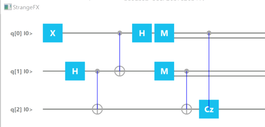

### Algorithm

Our program begins by initializing three qubits

```java
QuantumExecutionEnvironment simulator = new SimpleQuantumExecutionEnvironment();
Program program = new Program(3);
```

We assume that the first qubit (the top qubit q[0] in the above diagram) belongs to Alice and starts out in any `|phi>` state, since this is what the quantum teleportation algorithm assumes. 

The second qubit (q[1] in the same diagram) belongs to Alice as well. 

The first thing to do is to share an entangled state between Alice and Bob by applying a `Hadamard` gate on Alice's q[1] qubit and then performing a `Controlled-Not` gate on Bob's q[2] qubit.

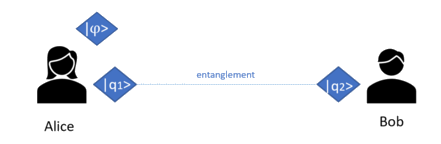

Applying the Hadamard gate to Alice's first qubit is easily achieved via the java Strange API by:

```java
Step step1 = new Step();
step1.addGate(new Hadamard(1));
```
In the lines below A stands for Alice and B stands for Bob, as the first qubit belongs to Alice (q[1] in the diagram above) and the second qubit belongs to Bob (q[2] in the diagram above).

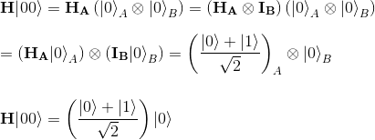

This is almost an `EPR` pair. To make it exactly an `EPR` pair, as we know we have to  perform a `C-NOT` gate, controlling on the first qubit. 

```java
Step step2 = new Step();
step2.addGate(new Cnot(1,2));
```

Doing so yields in quantum formalism:

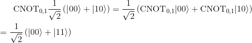


We now have **Alice and Bob sharing an EPR pair**.

The next step is to have Alice perform a `C-NOT` gate between her qubit `|phi>` and her half of the entangled pair.

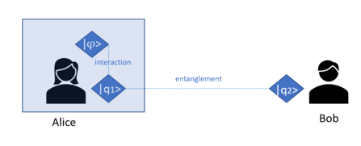

With java Strange API, we apply easily this `C-NOT` gate with qubit 0 as control qubit and qubit 1 as the target by writing

```java
Step step3 = new Step();
step3.addGate(new Cnot(0,1));
```
or more formally

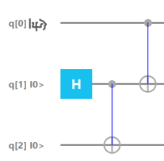

Note that the state of the entire system (Alice + Bob qubits) is

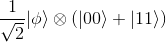

If we express |phi> in terms of the computational basis states `|phi> = alpha |0> + beta |1>` with (alpha,beta) complex numbers, we get four terms describing the whole state

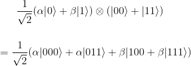

This expression enables us to easily perform a `C-NOT` gate between the first and second qubits.  We are doing so by flipping the second qubit only if the first qubit is `|1>`, and we obtain the state:

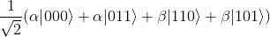


We now have to perform a `Hadamard` gate on the first qubit:

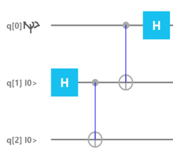

This is implemented in our java program via

```java
Step step4 = new Step();
step4.addGate(new Hadamard(0));
```

Reminding us that applying the `Hadamard` gate to the basis states, this equates in quantum mechanics formalism to:

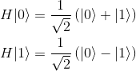

so

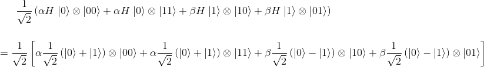

or by expanding

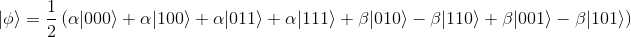

We are done with all the gate operations we have to do before the measurement.

#### Alice's measurements and Bob's operations

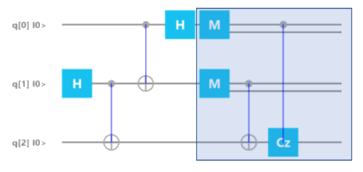

It's now time to measure the `qubit[0]` and `qubit[1]` by calling `new Measurement(qubit_index)`

```java
Step step5 = new Step();
step5.addGate(new Measurement(0));
step5.addGate(new Measurement(1));
```

There are only two gates left to apply, the `C-NOT` gate between the second and third qubit (i.e `qubit[1]` and `qubit[2]`) and the `Pauli-Z` gate between the first and third qubits (`qubit[0]` and `qubit[2]`).

This achieved by executing those simple instructions:

```java
Step step6 = new Step();
step6.addGate(new Cnot(1,2));
step step7 = new Step();
step7.addGate(new Cz(0,2));
```

To check our algorithm, we just have to initialize the teleported qubit in the `alpha|0> + beta|1>` superposition state with some specific values for alpha and beta, run it multiple times and make sur that Bob's qubit will we observed with the same probabilities.

For example, adding the following line of code just before our program is run


```java
program.initializeQubit(0, .866);
```

will initialize out first qubit (index=0) with the value alpha set to square_root(3)/2 = 0.866.

We finally ask to show the probabilities for 1000 runs by invoking

```java
Renderer.renderProgram(program);
Renderer.showProbabilities(program, 1000);
```

Following **Max Born's rule**, the probability to measure 0 is the square of alpha, which means in our case **3/4=75% chance to measure 0** and therefore **25% chance to measure 1**.

Running our program by invoking <code>mvn javafx:run</code> from the <code>teleportation</code> folder yields to:

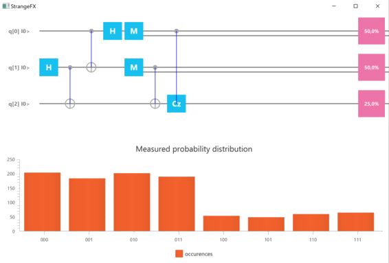

From the top half of the diagram, we see that there is now a probability of 25% that Bob’s qubit will now be measured as 1 (third line representing Bob's qubit[2]).

The bottom part of the figure shows a similar result: Bob's qubit measured as 1 corresponds to the last four combinations 100,101,110 and 111 and sum up roughly to 250.

This is exactly what we hoped for!

